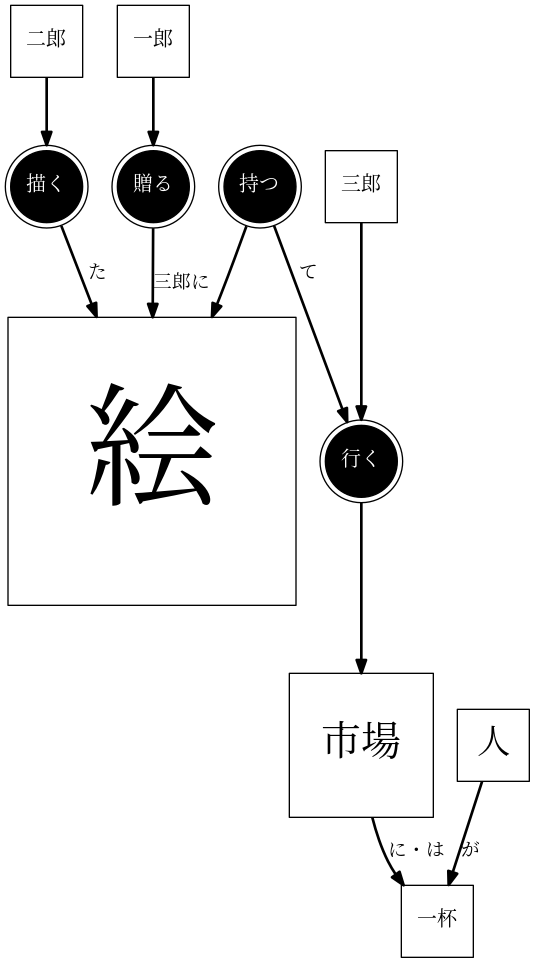

# Naruhodo(なるほど)

[](https://travis-ci.org/superkerokero/naruhodo)
[](https://opensource.org/licenses/MIT)

[English version](README.md)

Naruhodoは生の日本語テキスト・日本語テキストを含むWebページからnetworkxフォーマットの依存構造グラフ（DG）と情報構造グラフ（KG）を生成するためのPythonライブラリーです。Notebook内で直接可視化が可能で、JSONファィルに出力して外部プログラムに使わせる事も可能です。

### 依存構造グラフ（DG）

[依存構造解析](https://web.stanford.edu/~jurafsky/slp3/14.pdf)とは、 コンピュータプログラムで[依存文法](https://en.wikipedia.org/wiki/Dependency_grammar)に沿ってテキスト解析する事です。
依存構造は有向グラフで表す事ができます。

Naruhodoは依存構造解析プログラムの出力を直接読み込んでDGを生成します。 

この図は下記のテキストで生成されたDGです。

```
"一郎は二郎が描いた絵を三郎に贈った。"
"三郎はこの絵を持って市場に行った。"
"市場には人が一杯だ。"
```


この図はWebページ [Wikipedia-ja: LLVM](https://ja.wikipedia.org/wiki/LLVM) から生成されたDGです。


### 情報構造グラフ（KG）

DGと違って、情報構造グラフ（KG）がキャプチャーしようとするのは実体の間の意味のある関係です。KGも外部の構造解析プログラムの出力から生成されますが、生成プロセスのロジックが違います。

KGで使えるメソッドはDGとほぼ同じです。

この図は下記のテキストで生成されたKGです。

```
"一郎は二郎が描いた絵を三郎に贈った。"
"三郎はこの絵を持って市場に行った。"
"市場には人が一杯だ。"
```



この図はWebページ [Wikipedia-ja: LLVM](https://ja.wikipedia.org/wiki/LLVM) から生成されたKGです。


## インストール

Naruhodo は　`pip` でGithubからインストールする事ができます:

```bash
pip install git+https://github.com/superkerokero/naruhodo.git
```

Naruhodo は外部プログラムで形態素解析と依存構造解析を行います。故にNaruhodoをつかうためには、対応している外部プログラムをインストールする事も必要です。

Naruhodo は複数のバックエンドプログラムに対応できるように設計されていますが、今は　`mecab` + `cabocha` のみをサポートしています。

`mecab` と `cabocha` のインストールについては、この記事を参照してください：

[Amazon Linux に MeCab と CaboCha をインストール](https://qiita.com/january108/items/85c80769ea870c190eaa)

他のバックエンドプログラム（`KNP` など）へのサポートはこれから追加する予定です。

## チュートリアル

Naruhodo のチュートリアルはリポジトリのルートフォルダに　`ipynb` ファィルとして用意されています。ブラウザから直接閲覧する事も可能です。このチュートリアルには　Naruhodo の主な機能をすべて紹介しています。

[チュートリアルのノートブック](https://github.com/superkerokero/naruhodo/blob/master/Tutorial.ipynb)
