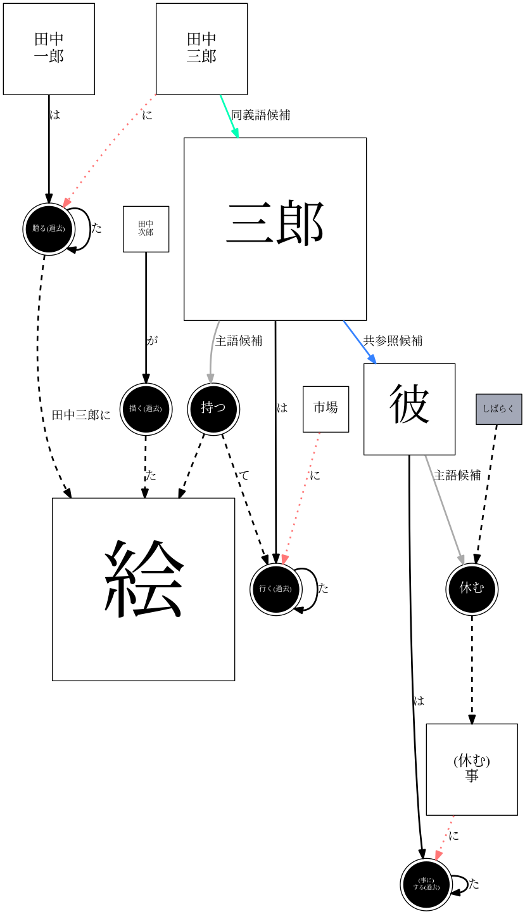

# Naruhodo(なるほど)

[](https://travis-ci.org/superkerokero/naruhodo)
[](https://opensource.org/licenses/MIT)
[](https://badge.fury.io/py/naruhodo)

[English version](README.md)

`naruhodo`は人間が読めるテキストからセマンティックグラフを自動的に生成するためのPythonライブラリーです。`naruhodo`で生成されたグラフは全て[networkx](https://networkx.github.io/)オブジェクトなので、さらなるグラフ解析・処理は簡単に行なえます。

サポートされている言語：

* 日本語
* 英語（WIP）
* 中国語（WIP）

サポートされているマンティックグラフの種類：

* 知識構造グラフ（KSG）：実体・述語モデルによる知識表現の有向グラフ
* 依存構造グラフ（DSG）：文法的依存構造に基づく有向グラフ

`naruhodo`には[nxpd](https://github.com/chebee7i/nxpd)で簡単な可視化機能を提供しています。

### 知識構造グラフ（KSG）

知識構造グラフ（KSG）がキャプチャーしようとするのは実体の間の意味のある関係です。KSGはある種の汎用知識ベースの有向グラフ表示として考えられます。KSGは外部の構造解析プログラムの出力に基づいて生成されます。

KSGには主に二種類のノードがあります：
* 特定の実体を表す実体ノード
* ある種の性質・アクションを表す述語ノード

実体ノードは述語ノードで繋がれます。エッジはノード間の繋がりを表せます。もし実体に何か性質を持っている、もしくは何かアクションを取っていたのであれば、この実体ノードから対応の述語ノードにエッジが指します。もし実体ノードはある種の性質の要素として存在する、もしくは何かアクションの対象になっている場合、対応の述語ノードからこの実体ノードにエッジが指します。

このようなグラフ構造は人の脳のなかの情報・知識の在り方にかなり近いと思います。自動的にできるだけ正確・完全なKSGを生成する事が`narukodo`の主な目標です。

この図は下記のテキストで生成されたKSGです。

```
"田中一郎は田中次郎が描いた絵を田中三郎に贈った。"
"三郎はこの絵を持って市場に行った。"
"彼はしばらく休む事にした。"
```



### 依存構造グラフ（DSG）

[依存構造解析](https://web.stanford.edu/~jurafsky/slp3/14.pdf)とは、 コンピュータプログラムで[依存文法](https://en.wikipedia.org/wiki/Dependency_grammar)に沿ってテキスト解析する事です。
依存構造は有向グラフで表す事ができます。
`naruhodo`は依存構造解析プログラムの出力を直接読み込んでDSGを生成します。 

この図は下記のテキストで生成されたDSGです。

```
"田中一郎は田中次郎が描いた絵を田中三郎に贈った。"
"三郎はこの絵を持って市場に行った。"
"彼はしばらく休む事にした。"
```


## インストール

`naruhodo`は`python`バージョン 3.4 以降をサポートします。

`pip` で簡単にインストールできます:

```bash
pip install naruhodo
```

この方法は`naruhodo`のリリースバージョンをインストールします。 
開発中のバージョンは以下のコマンドで github から直接インストールできます:

```bash
pip install https://github.com/superkerokero/naruhodo/archive/dev.zip
``` 

`naruhodo`は外部プログラムで形態素解析と依存構造解析を行います。故にNaruhodoをつかうためには、対応している外部プログラムをインストールする事も必要です。

`naruhodo`は複数のバックエンドプログラムに対応できるように設計されていますが、今は　`mecab` + `cabocha` のみをサポートしています。

`mecab` と `cabocha` のインストールについては、この記事を参照してください：

[Amazon Linux に MeCab と CaboCha をインストール](https://qiita.com/january108/items/85c80769ea870c190eaa)

他のバックエンドプログラム（`KNP` など）へのサポートはこれから追加する予定です。

## ノードとエッジの属性

`naruhodo`で生成されたセマンティックグラフは[networkx](https://networkx.github.io/) [`DiGraph`](https://networkx.github.io/documentation/latest/reference/classes/digraph.html) オブジェクトに保存されています。ノードとエッジに付与された属性は以下のテーブルに載せています。

* **ノードの属性**

  | Property | Description                                                                                                                     |
  |:--------:|---------------------------------------------------------------------------------------------------------------------------------|
  | name     | A string that stores the name of the node stored in the graph. This is what you use to refer to the node from graph object.     |
  | count    | An integer representing the number of this node being referred to. Can be used as an indicator of node's significance.          |
  | type     | An integer representing the type of the node. For meanings of integers, refer to the table of node types below.                 |
  | rep      | A string that stores the normalized representation of the node. This is what you see from the visualizations.                   |
  | pro      | An integer representing the pronoun type of this node. For meanings of integers, refer to the table of pronoun types below.     |
  | NE       | An integer representing the named-entity(NE) type of this node. For meanings of integers, refer to the table of NE types below. |
  | pos      | A list of integers representing the id of sentences where this node appears.                                                    |
  | surface  | A string that stores the surface of this node(original form as it appears in the text).                                         |

* **ノードのタイプ**

  | Type ID | Description   |
  |---------|---------------|
  | -1      | Unknown type  |
  | 0       | Noun          |
  | 1       | Adjective     |
  | 2       | Verb          |
  | 3       | Conjective    |
  | 4       | Interjection  |
  | 5       | Adverb        |
  | 6       | Connect       |

* **代名詞タイプ**

  | Pronoun ID | Description                       |
  |------------|-----------------------------------|
  | -1         | Not a pronoun(or unknown pronoun) |
  | 0          | Demonstrative-location            |
  | 1          | Demonstrative-object              |
  | 2          | Personal-1st                      |
  | 3          | Personal-2nd                      |
  | 4          | Personal-3rd                      |
  | 5          | Indefinite                        |
  | 6          | Inclusive                         |
  | 7          | Omitted subject                   |


* **Named-entity　タイプ**

  | NE ID | Description                  |
  |-------|------------------------------|
  | 0     | Not named-entity(or unknown) |
  | 1     | Person                       |
  | 2     | Location                     |
  | 3     | Organization                 |
  | 4     | Number/Date                  |

* **エッジの属性**

  | Property | Description                                                                                                        |
  |----------|--------------------------------------------------------------------------------------------------------------------|
  | weight   | An integer representing the number of appearance of this edge. Can be used as an indicator of edge's significance. |
  | label    | A string that stores the label of this edge.                                                                       |
  | type     | A string that stores the type of this edge. For details, refer to the table of edge types below.                   |

* **エッジのタイプ**

  | Type    | Description                                |
  |---------|--------------------------------------------|
  | none    | Unknown type(also used in DSG edges)       |
  | sub     | Edge from a subject to predicate           |
  | autosub | Edge from a potential subject to predicate |
  | obj     | Edge from a predicate to object            |
  | aux     | Edge from auxiliary to predicate           |
  | cause   | Edge from potential cause to result        |
  | coref   | Edge from potential antecedent to pronoun  |
  | synonym | Edge from potential synonym to an entity   |

## チュートリアル

`naruhodo`のチュートリアルはリポジトリの`tutorial`フォルダに`ipynb` ファィルとして用意されています。ブラウザから直接閲覧する事も可能です。

[日本語解析チュートリアルのノートブック](https://github.com/superkerokero/naruhodo/blob/master/tutorial/Tutorial-Ja.ipynb)

## Python-API

Python API ドキュメントはここ:

[`naruhodo` Python API Reference](https://superkerokero.github.io/naruhodo).

このドキュメントは [pdoc](https://github.com/BurntSushi/pdoc)を使って自動的にソースコードから生成されるので、常に最新のデータに更新されています。

## Change-Log

* 0.2.2
  * Tweaks for use with naruhodo-viewer.
* 0.2.1
  * Primitive coreference resolution for Japanese.
* 0.2.0
  * Major API change for multi-language support and parallel processing. 
  * Parallel processing support for parsing using multiprocessing module. 
* 0.1.0
  * Initial version

## 開発状況とコメント

`naruhodo` はまだ開発の途中（特にKSG部分）なので、時々おかしなリザルトを返す事があると予想されます。

もしあなたも `naruhodo` のアイデアが気に入って、開発に協力したいと思うなら、Githubでプルリクエストをしてください。

以下は `naruhodo` の開発についてのコメント:

* ### 生成されたグラフの質向上 (0.2 ~ 0.5)
    
    
    ソースコードからわかるように、`naruhodo`はルールベースのシステムに依存して、与えられた情報を解析します。そして言語のような複雑かつ大規模な問題に対して実用に耐えるものを作るには、長期的なテストと継続的な改善が必要です。

    現在、`naruhodo`によって生成された知識構造グラフ（KSG）は、大量の入力テキストに対しての解析効果はまだ良くない。改良は、入力テキストの多様性とそれに対応する構文解析ロジックの洗練化から来るでしょう。

    ルールベースのシステムは基本、限界があります。ただ、私はNLPの領域で、特に基本的な情報解析タスクでは、ルールベースのシステムも実用的なアプリケーションが作れると信じています。ディープ・ラーニングのような統計学ベースの手法の最近の進歩は有望視されている。しかし、これらの技術のほとんどが、大量のラベル付きデータを必要とします。ここで取られたルールベースのアプローチは、NLPのAb Initio方法として考えられます（有用な予測を行う前にトレーニングデータを必要としません）。このようなアプリケーションは、退屈な作業の一部を自動化することによって、大量のラベル付きデータを収集するという苦痛を少なくとも軽減することができる事が出来れば良いと思います。 `naruhodo`は、NLPの世界でのルールベースのシステムの限界に関する私の個人的な実験でもあります。最終的には役に立たないかもしれませんが、興味深い旅になると確信しています。

* ### さらに多くのバックエンドをサポート (0.5 ~)
    
    インターネット上では、日本語向けの構造解析プログラムはまだ多くありません。 `mecab` +` cabocha`のほかに、最も使いやすい構文解析プログラムは `juman（++）` + `knp`くらいです。 `knp`の出力フォーマットには余分な有用な情報が含まれており、場合によっては`cabocha`よりも正確である可能性があります。しかし、その出力には統一されたスキームがなく、使いにくいものになっています。もう一つの重要な事実は、 `juman（++）` + `knp`の解析は` mecab` + `cabocha`に比べて非常に時間がかかることです。

    私は`spaCy`のようないくつかの高速汎用ライブラリを探しています。日本語は現時点で正式にサポートされている言語ではありませんが、かなり期待できると思います。

    要約すると、`naruhodo`は複数のバックエンドをサポートするように設計されていますが、現在のフォーカスは日本語のみであるため、他のバックエンドのサポートを追加することは優先事項ではありません。

* ### 他の言語へのサポート(?~)
    
    `naruhodo`が今サポートしている言語は、日本語だけです。日本語を選んだのです。それは私の個人的な関心の他に、日本語は挑戦的で報われるという独特の特徴を持っているからです。私の理解では、日本語に関する難しさは、表現があいまいであること（例えば、主題が頻繁に日本語で省略されることが多い）や大量の単語変換（同じ動詞が10+以上の形を持つことができる）から生じます。

    実用的な観点からは、英語や中国語などの言語は潜在的に大きな需要がある。したがって、`naruhodo`のルールベースのアプローチが後で使用可能であることが判明すれば、将来、これらの一般的な言語にライブラリを拡張することを考えています。

* ### 統計的手法を入れる(?~)
    
    最近、皆さんは機械学習に興奮しているようです。私も強化学習や生成的な敵対的なモデルのような技術で、大きなアプリケーションの可能性を見ています。そして、私は、これらのテクニックのいくつかの特定の知識検索の問題への応用についていくつかの考えを持っています。たとえば共参照解析はルールベースのシステムの範囲外であることは明らかであり、この場合、強化学習ベースのアプローチは非常に魅力的です（ユーザーからのリアルタイムのフィードバックシステムがあれば）。
    
    機械学習技術の理解が向上するにつれて、統計ベースのアプローチが将来追加される可能性があります。

* ### 共参照解析機能 (0.2.1 ~)

    [共参照解析](https://en.wikipedia.org/wiki/Coreference)は、テキスト内の同じエンティティを参照するすべての表現を見つけるタスクです。 適切な共参照解決がなければ、生成されたKSGはすべての意味のある情報を取得するわけではなく、そのユーザビリティはかなり制限されます。バージョン0.2.1から`naruhodo`にプリミティブな共参照解析機能が実装された。ただ性能はよくないので、まだ実用性に欠けます。
    
    私は共参照解析に関するいくつかの論文を調べています。単語の埋め込みと強化学習に基づくメソッドは、バージョン0.5〜から`naruhodo`に追加される予定です。

* ### 生成されたグラフの具体的応用(new projects)
    
    依存構造グラフや知識構造グラフは構造化した情報の自動取得・保存・管理で役に立ちます。 具体的な応用例として： 
    * 要約の自動生成
    * 問答システム・翻訳システムのためのデータベース構築
    * 特定の実体に関する感情分析

    KSGの質が満足できるようになれば、私はこれらの応用にも挑戦して見たいと思います。

