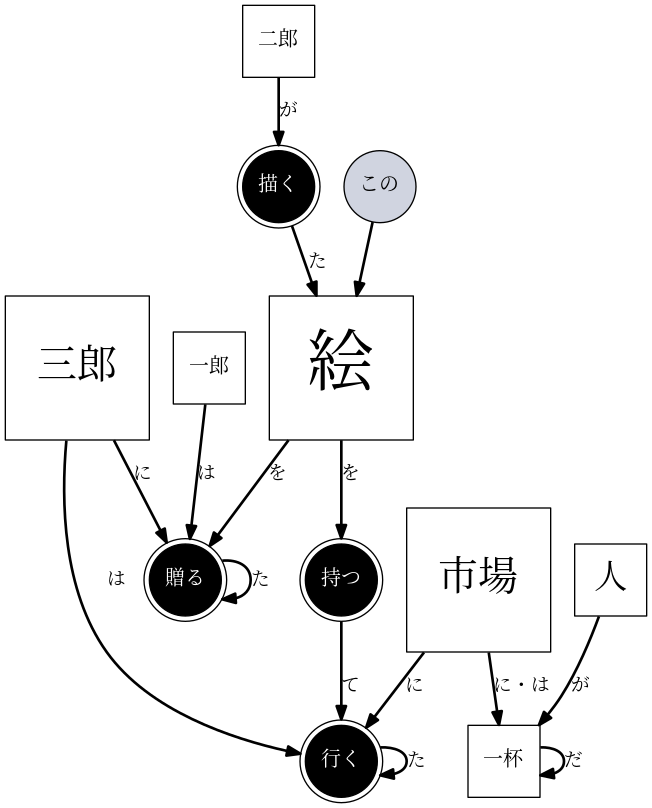

# Naruhodo(なるほど)

[](https://travis-ci.org/superkerokero/naruhodo)
[](https://opensource.org/licenses/MIT)

[English version](README.md)

Naruhodoは生の日本語テキスト・日本語テキストを含むWebページからnetworkxフォーマットの依存構造グラフ（DG）と情報構造グラフ（KG）を生成するためのPythonライブラリーです。Notebook内で直接可視化が可能で、JSONファィルに出力して外部プログラムに使わせる事も可能です。

### 依存構造グラフ（DG）

[依存構造解析](https://web.stanford.edu/~jurafsky/slp3/14.pdf)とは、 コンピュータプログラムで[依存文法](https://en.wikipedia.org/wiki/Dependency_grammar)に沿ってテキスト解析する事です。
依存構造は有向グラフで表す事ができます。

Naruhodoは依存構造解析プログラムの出力を直接読み込んでDGを生成します。 Below is an example of DG generated by naruhodo using the following texts.

```
"一郎は二郎が描いた絵を三郎に贈った。"
"三郎はこの絵を持って市場に行った。"
"市場には人が一杯だ。"
```



This is an example of DG generated from [Wikipedia-ja: LLVM](https://ja.wikipedia.org/wiki/LLVM)


### 情報構造グラフ（KG）

DGと違って、情報構造グラフ（KG）がキャプチャーしようとするのは実体の間の意味のある関係です。KGも外部の構造解析プログラムの出力から生成されますが、生成プロセスのロジックが違います。

KGで使えるメソッドはDGとほぼ同じです。

Below is an example of KG generated by naruhodo using the following texts.

```
"一郎は二郎が描いた絵を三郎に贈った。"
"三郎はこの絵を持って市場に行った。"
"市場には人が一杯だ。"
```


This is an example of KG generated from [Wikipedia-ja: LLVM](https://ja.wikipedia.org/wiki/LLVM)


## Installation

You can install the library directly from github using pip:

```bash
pip install git+https://github.com/superkerokero/naruhodo.git
```

Naruhodo relies on external programs to do Japanese word and dependency parsing, so you need to have corresponding programs installed as well.

Naruhodo is designed to support multiple backend parsers, but currently only the support for `mecab` + `cabocha` is implemented.

For guide on installing `mecab` and `cabocha`, please refer to this page:

[Amazon Linux に MeCab と CaboCha をインストール](https://qiita.com/january108/items/85c80769ea870c190eaa)

Support for other parsers such as `KNP` is planned in the future.

## Tutorial

The tutorial of naruhodo is provided as a `ipynb` file in the root folder. You can view it directly in your browser. This tutorial covers all the main functionalities of naruhodo.

[Tutorial notebook](https://github.com/superkerokero/naruhodo/blob/master/Tutorial.ipynb)
